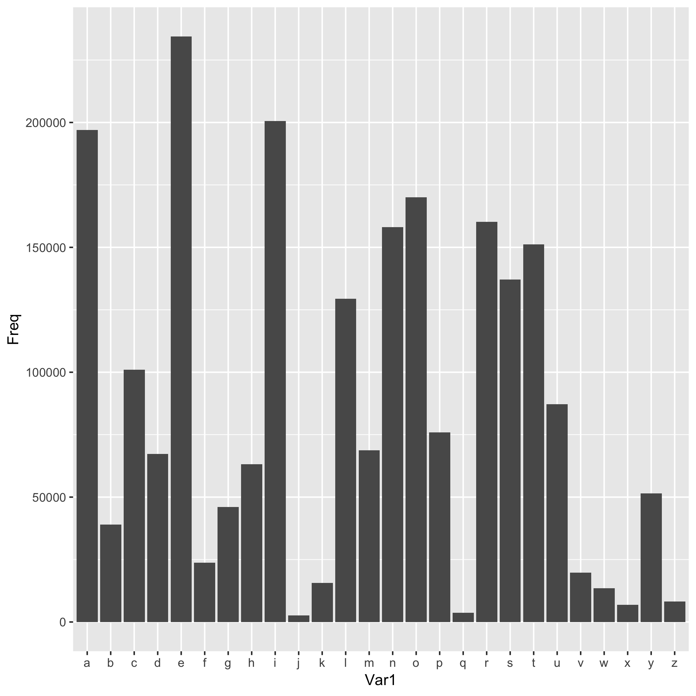

```{r load-hist-dat, include = FALSE}
letter_count <- read.delim("letter_count.tsv")
```

I computed the letter composition of each word, i.e. the letter frequencies, and plotted the frequency of each letter in their respective order in the alphabet. 

The most frequent letters are: E, A, I, O and oddly enough R

Here is a bar graph of this data. 


